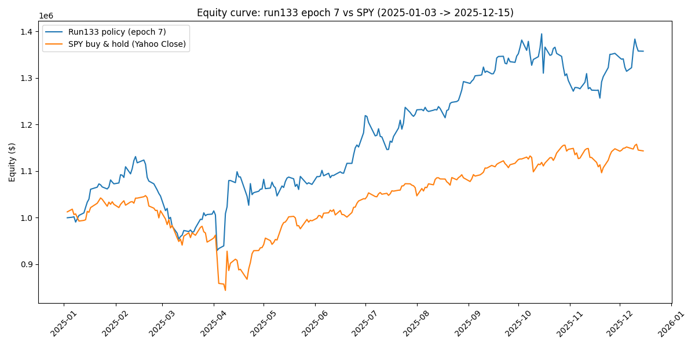
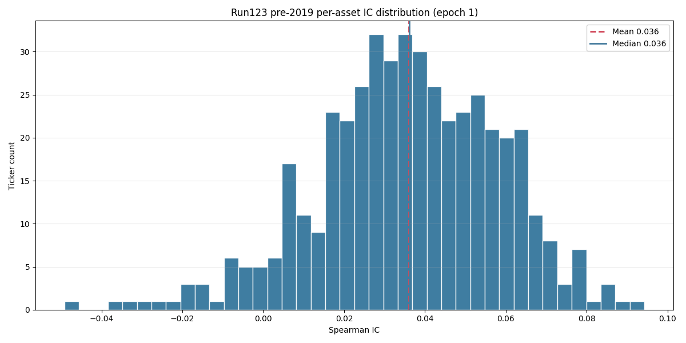
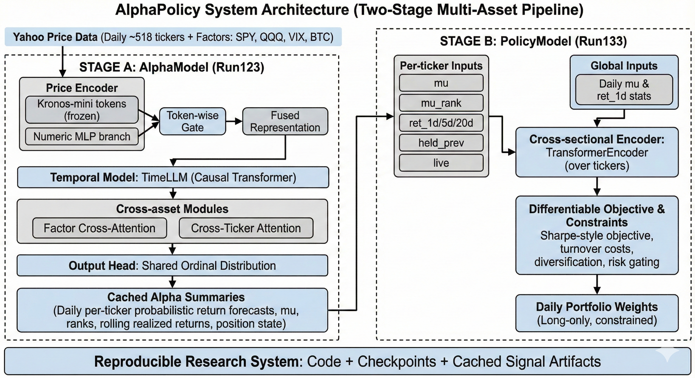
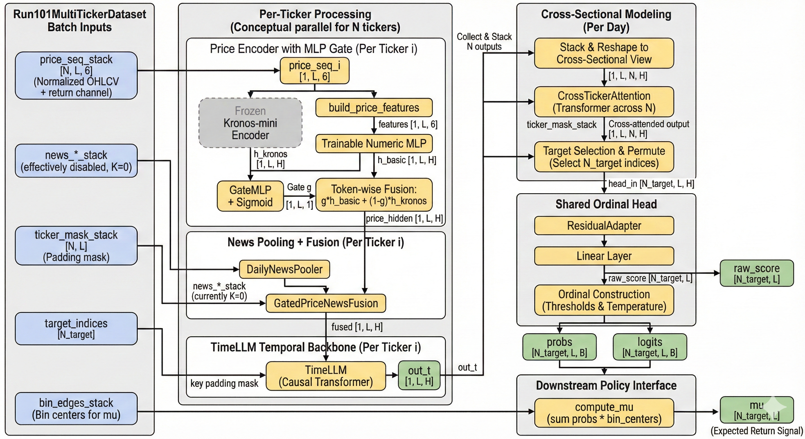
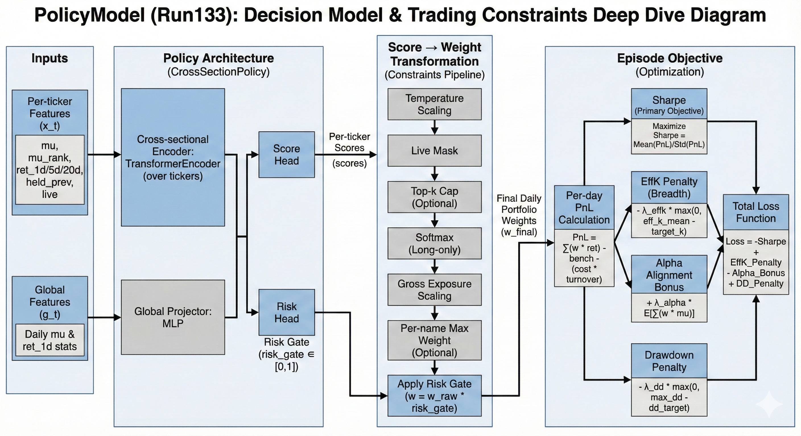

## AlphaPolicy

Trained on daily Yahoo price data with a fixed US-heavy universe (~518 tickers, S&P 500-style) plus factor assets (SPY, QQQ, VIX, BTC). AlphaModel splits: train ≤ 2024-06-30, val 2024-07-01 → 2024-09-30, test 2024-10-01 → 2024-12-31. PolicyModel trains on 2019-01-03 → 2024-12-30 signals. We report results on 2024-Q4, a 2010–2018 golden set, and a 2025 forward eval.

Run133 policy equity curve vs SPY (epoch 7, SPY uses Yahoo Close). 2025-01-03 to 2025-12-15; Sharpe ~1.50, max DD ~17.8%, mean turnover ~0.180, equity ~1.36x.

Run123 pre-2019 per-asset IC distribution (epoch 1, n=459 tickers). Mean IC ~0.036, median ~0.036; coverage ~0.987, turnover ~0.0025.

**AlphaPolicy** is a reproducible two-stage multi-asset research system:

1. **AlphaModel (Run123)** produces daily per-ticker probabilistic return forecasts (a discrete distribution over return bins).
2. **PolicyModel (Run133)** maps cached alpha summaries (`mu`, ranks, rolling realized returns, position state) into daily portfolio weights using a cross-sectional Transformer and a differentiable Sharpe-style objective with costs and constraints.

This repo includes **code + checkpoints + cached signal artifacts** to reproduce the full pipeline.

### What this is / isn’t

* This is research software for experimentation and education.
* Not investment advice. No claim of robustness across all markets, costs, or regimes.

## Architecture overview

Two-stage system overview: AlphaModel produces per-ticker distributions and cached signals; PolicyModel maps them to daily weights under constraints.

**Stage A — AlphaModel**

AlphaModel detail: price encoder (Kronos-mini + MLP gate), TimeLLM temporal backbone, cross-asset modules, ordinal head, and mu computation.

* Price encoder: frozen Kronos-mini tokens + trainable numeric MLP branch, fused by a token-wise gate.
* Temporal model: causal transformer (TimeLLM).
* Cross-asset modules: factor cross-attention + optional cross-ticker attention.
* Output: ordinal/histogram distribution over next-day log return bins; `mu` is the expected return computed from bin probabilities and bin centers.

**Stage B — PolicyModel**

PolicyModel detail: cross-sectional Transformer over tickers, score-to-weight constraints pipeline, and differentiable Sharpe-style objective.

* Inputs per ticker (7): `mu`, `mu_rank`, `ret_1d/5d/20d`, `held_prev`, `live`
* Global inputs (5): daily stats of `mu` and `ret_1d`
* Cross-sectional encoder: TransformerEncoder over tickers
* Outputs: daily long-only weights (softmax + caps); optional risk gating (run133)

## Reproduce: end-to-end (2025 evaluation)

High-level steps:

1. Fetch latest prices (Yahoo)
2. Build inference dataset (price-only)
3. Dump alpha signals (Run123)
4. Evaluate policy checkpoints (Run133) vs SPY

Commands (see `docs/run134_inference_commands.md` for full scripts):

* `scripts/fetch_data.py` (Yahoo refresh)
* `scripts/build_run101_price_only_batch.py` (incremental sequences)
* `scripts/build_run102_fullseq_auto.py` (`RUN100_ALL_SPLITS_TEST=1`)
* `scripts/dump_run125_signals.py` (creates `.npz`)
* `scripts/eval_run130_policy.py` (portfolio evaluation)

## Key results (current)

* 2024-Q4 test split (TopK allocator on alpha): Sharpe ~0.58 at 5 bps costs (K=50).
* 2010–2018 golden set (TopK allocator on alpha): Sharpe reported ~0.69 (see `docs/run125_alpha_policy_report.md`; regime sensitivity exists).
* 2025 policy eval (Run133 epoch 7): raw Sharpe ~1.50, max DD ~17.8%, mean turnover ~0.179, effK ~3.42 (see `logs/run133_portfolio_latest/`).

**Important:** current `eval_run130_policy.py` ignores run133 risk gating due to `strict=False` loading into the older policy class. See `docs/evaluator_alignment.md`.

## Roadmap (credibility upgrades)

* Add attribution suite: no-μ / shuffled-μ / lagged-μ / μ-only
* Fix evaluator to apply run133 risk gate
* Add beta-to-SPY and excess-return metrics in daily logs
* Document corporate actions / return definition / survivorship handling

## Reproducibility

Step-by-step:

1. Fetch Yahoo prices
2. Build inference dataset
3. Dump signals
4. Evaluate policy vs SPY

## Credibility (how we validate)

* We will report attribution ablations (no-μ / shuffled-μ / lagged-μ) to verify policy performance depends on alpha signal content.

## Disclaimers

Research only. Not financial advice. Data licensing may apply.

## Title

**AlphaPolicy: A Reproducible Two-Stage Multi-Asset Alpha and Portfolio Policy System Using Distributional Forecasting and Cross-Sectional Allocation**

## Abstract

We introduce **AlphaPolicy**, a two-stage open-source research system for multi-asset trading. The first stage, **AlphaModel**, produces per-asset daily return forecasts in the form of a **discrete predictive distribution** over return bins, trained with an ordinal/histogram head and a distributional objective (cross-entropy and CRPS, with tail-weighting). The second stage, **PolicyModel**, maps cached alpha summaries (expected return `mu`, rank features, rolling realized returns, and minimal state features) into daily portfolio weights using a **cross-sectional TransformerEncoder** and a differentiable portfolio objective (Sharpe maximization with turnover costs and diversification constraints).

The released inference stack uses **AlphaModel Run123 (`outputs/run123/epoch_1.pt`)** to generate daily alpha signals over a fixed universe (pinned by `data/run102_fullseq/run100_manifest.json`, ~518 tickers plus factor assets), and **PolicyModel Run133 (`outputs/run133_portfolio/epoch_7.pt`)** to produce long-only weights. We provide reproducible end-to-end commands to fetch price data (Yahoo), rebuild inference datasets, dump signals (`.npz`), and evaluate portfolio outcomes against SPY. The repository includes code, checkpoints, and cached signals for repeatable research and auditing.

## 1. Introduction

### 1.1 Motivation

Quantitative ML systems typically fail in one of two ways: (i) predictive models look statistically promising but cannot be converted into stable portfolios after costs; or (ii) allocation heuristics produce portfolios but do not isolate whether the underlying signal is meaningful. AlphaPolicy is designed to address this with a strict modular separation:

* **AlphaModel:** learns an alpha signal as a probabilistic return forecast.
* **PolicyModel:** learns how to convert that signal (and minimal state) into a constrained portfolio.

This split makes the system easier to evaluate, easier to reproduce, and more credible for research communication: it forces explicit definitions of timing, costs, turnover, and constraints, and enables attribution tests that determine whether performance comes from the alpha signal itself.

### 1.2 Contributions

1. **Two-stage, reproducible alpha→policy pipeline** with end-to-end scripts and cached artifacts (signals and checkpoints).
2. **Distributional return modeling** (discrete return distribution per ticker per day) enabling calibration-aware training and tail-weighted objectives.
3. **Cross-sectional portfolio policy** that outputs daily weights with explicit cost and diversification controls (turnover cost, effective number of names).
4. **Out-of-window stress evaluation**: a pre-2019 “golden set” (2010–2018) and post-2025 evaluation workflow (2025 onward) that is not in training.

## 2. Data and Universe

### 2.1 Universe and assets

* Universe is pinned to `data/run102_fullseq/run100_manifest.json` (~518 tickers). Factors include **SPY, QQQ, VIX, BTC**.
* Market/region is not explicitly documented; implied to be largely US equities given SPY/QQQ usage.
* **Survivorship-free handling:** marked “Yes” in current notes; the exact method (point-in-time membership, delisting inclusion, etc.) should be documented in the manifest generation pipeline (not currently described in repo docs).

### 2.2 Price data source

* Prices are refreshed from **Yahoo** via `scripts/fetch_data.py` / `scripts/fetch_yahoo_equity` (plus crypto via Yahoo).
* **Corporate actions handling is not specified.** For paper-grade rigor, clarify whether “Adjusted Close” is used, how splits/dividends are adjusted, and how delistings are treated.

### 2.3 News data

* In the current public version, news is **not reliably trained/used** due to limited access to quality datasets. The inference path is effectively **price-only** (news set to zeros or bypassed).

## 3. Chronological splits and evaluation windows

### 3.1 AlphaModel splits (documented run100 dates)

* Train: `<= 2024-06-30`
* Val: `2024-07-01 .. 2024-09-30`
* Test: `2024-10-01 .. 2024-12-31`

### 3.2 PolicyModel splits

* Policy training signals cover **2019-01-03 → 2024-12-30** with train/val/test masks within that period.

### 3.3 Out-of-sample “golden” and post-2025 evaluation

* Golden pre-2019 set: **2010-01-04 → 2018-12-31** (manifest: `data/run102_golden_pre2019/run102_golden_manifest_filtered.json`)
* Post-2025 eval workflow (run134):

  * Signals cover **2020-01-02 → 2025-12-15**
  * Portfolio evaluation typically starts at **2025-01-01** and runs through **2025-12-15** with an optional preview row for **2025-12-16** (`--emit_last_day`).

## 4. AlphaModel (Run123 inference model)

### 4.1 High-level architecture

AlphaModel is implemented as `Run100FullSeqModel` with a multi-ticker forward path. The released inference checkpoint is **Run123 epoch_1** (`outputs/run123/epoch_1.pt`), used by `scripts/dump_run125_signals.py`.

Core components:

**(A) Price encoder: Kronos-mini + numeric MLP gate**

* `PriceEncoderWithMLP` combines:

  * **Frozen Kronos-mini encoder** (`KronosMiniPriceEncoderFullSeq`) producing hidden tokens.
  * A **trainable numeric MLP** over derived features from normalized OHLCV+return.
  * A **token-wise sigmoid gate** over concatenated representations:
    [
    g_{t,i} = \sigma(W \cdot [h^\text{MLP}_{t,i}; h^\text{Kronos}_{t,i}] + b),
    \quad
    h_{t,i} = g_{t,i} h^\text{MLP}_{t,i} + (1-g_{t,i}) h^\text{Kronos}_{t,i}
    ]
* Default gate bias is -2.0, and `--gate_init_prob` can bias the initial mixture while keeping the gate learned.

**Numeric feature set (as implemented)** derived from normalized sequences:

* `r1` = daily log return
* `r5`, `r21` = rolling sums
* `vol21` = rolling std
* `hl` = (high-low)/close
* `volume_z`

**(B) Temporal model: TimeLLM**

* Causal transformer over per-day hidden tokens (mask-aware; full sequence).

**(C) Cross-asset modules**

* Factor cross-attention exists in the model (`FactorCrossAttention`).
* Cross-ticker attention exists and is **enabled** in the Run123 description; implemented via `CrossTickerAttention` in the multi-ticker forward path.

**(D) Output head: Shared ordinal distribution**

* `SharedOrdinalHead` produces a discrete distribution over bins via learnable thresholds and a temperature parameter.

### 4.2 Targets and timing

* Targets are **next-day log returns** (t → t+1).
* Teacher forcing is used: predictions at time t align to label at t+1 (shifted window).

Exact price definition for the return (close-to-close vs adjusted) is **not specified** and should be made explicit in the final paper.

### 4.3 Training loss (as implemented in training entry point)

Training supports:

* Cross-entropy on bin probabilities (`ce_weight`)
* CRPS discrete (`crps_weight`)
* Tail weighting:
  [
  w = (1 + 10|r|)\cdot(1 + 2\cdot \mathbf{1}(|r| > 0.03))
  ]
* Optional differentiable Sharpe-style term on (\mu\cdot r) (disabled unless `--lambda_sharpe > 0`)

**Note:** repo docs do not specify the exact CE/CRPS weights for Run123 training. In the write-up, treat them as configurable flags and, if possible, add the exact command/config used to produce `run123/epoch_1.pt`.

## 5. PolicyModel (Run133 portfolio policy)

### 5.1 Purpose and separation

PolicyModel is intentionally separate from AlphaModel:

* AlphaModel produces signals (`mu`, targets, masks) and caches them in `.npz`.
* PolicyModel consumes only cached signals and minimal state features and learns daily allocations.

This separation enables clean attribution: if a policy performs out-of-sample using only cached alpha summaries, it supports the claim that the alpha signal is economically meaningful—provided ablations confirm dependence on `mu`.

### 5.2 Inputs (per ticker and global)

Per-ticker (7 dims):

* `mu`, `mu_rank`
* `ret_1d`, `ret_5d`, `ret_20d` (rolling sums of realized returns)
* `held_prev` (position state)
* `live` (mask)

Global (5 dims):

* `mu_mean`, `mu_std`, `mu_max`, `mu_min`, `ret_1d_mean` over live tickers

### 5.3 Architecture

* Embed per-ticker features into hidden dimension (default 64).
* Cross-sectional encoder: `nn.TransformerEncoder` over tickers:

  * 2 layers, 4 heads (default)
  * PyTorch defaults: FFN dim 2048, dropout 0.1, activation ReLU, post-norm
  * `src_key_padding_mask` masks non-live tickers
* Global MLP → global embedding
* Per-ticker score head over `[h_i, g_emb]`

**Run133 adds**:

* Scalar risk gate: `risk_gate = sigmoid(risk_head(g_emb))`
* Optional drawdown penalty and ESS-style effective number of names

### 5.4 Scores → weights

* Temperature softmax on live scores
* Optional top-k cap (`k_cap`)
* Normalize to gross exposure (long-only default)
* Optional per-name cap (`w_max`)
* Risk gating (in run133 architecture): `w = risk_gate * w_raw`

### 5.5 Objective (as implemented in `scripts/run133_train_portfolio.py`)

Per-day PnL:
[
\text{pnl}_t = \sum_i w_{t,i}\cdot r_{t+1,i} - r^\text{SPY}_{t+1} - c\cdot \text{turnover}_t
]
Turnover:
[
\text{turnover}_t = 0.5\sum_i |w_{t,i}-w_{t-1,i}|
]
Sharpe is annualized from daily pnl.

Additional terms:

* Effective number of names (ESS):
  [
  \text{effK}_t = \frac{(\sum |w|)^2}{\sum w^2}
  ]
* Alpha alignment:
  [
  \alpha_t = \sum_i w_{t,i}\cdot \mu_{t,i}
  ]
* Drawdown penalty via max drawdown above `dd_target`

Total loss (confirmed signs):
[
\mathcal{L} = -\text{Sharpe} + \lambda_\text{effK}\cdot \max(0, \text{effK}-\text{targetK})
-\lambda_\alpha \cdot \mathbb{E}[\alpha] + \lambda_\text{dd}\cdot\max(0, \text{maxDD}-\text{ddTarget})
]

Run133 runbook hyperparameters (as provided):

* `lambda_effk=0.2`, `target_k=4`
* `lambda_alpha=0.1`
* `lambda_dd=1.0`, `dd_target=0.35`
* `k_cap=10`, `temperature=0.2`, `w_max=None`
* `cost_bps=5`

## 6. Inference and deployment workflow (Run134 “go-live”)

End-to-end inference is:

1. Fetch/append Yahoo data (equities + factor assets + BTC).
2. Build incremental run101 sequences (price-only).
3. Build run102 full-seq manifest with all dates marked live (`RUN100_ALL_SPLITS_TEST=1`).
4. Dump signals with alpha checkpoint `outputs/run123/epoch_1.pt` into `.npz`.
5. Evaluate (or run live) policy checkpoint(s), selecting an epoch.

Important operational constraint:

* Universe is pinned to the training manifest; adding new tickers without retraining changes cross-ticker attention inputs and can shift allocations.

## 7. Results (current evidence)

### 7.1 Alpha-to-portfolio baseline backtests (Run125 alpha-policy)

Using `scripts/run125_alpha_policy.py` on:

* Standard test split (2024-10-01 → 2024-12-31)
* Golden pre-2019 set (2010–2018)

**2024-Q4 test split (cost 5 bps):**

* TopK long-only (K=50): Sharpe **0.5788**, turnover **0.0390**
* Linear policy: Sharpe **0.2046**, turnover **0.1019**
* Long/short top/bottom K=50: Sharpe **-0.6067** (not stable under this setup)

**Golden pre-2019 (2010–2018, cost 5 bps, TopK K=50):**

* Reported overall Sharpe **0.6924** (note: recomputation including zero-trade days gives Sharpe ~0.428; resolve this discrepancy and use a single canonical computation in the final write-up).
* Year-by-year shows strong regime sensitivity: negative years (2011, 2015, 2018) and strong years (2013, 2017).

This framing highlights alpha utility: a simple allocator can extract signal, but performance is regime-sensitive and motivates a stronger decision layer (PolicyModel).

### 7.2 Policy evaluation (Run133 epoch selection on 2025)

From `logs/run133_portfolio_latest/run133_epoch7_*` summary (2025-01 onward; ~239 days plus a preview row):

* raw Sharpe ≈ **1.50**
* max drawdown ≈ **-0.178**
* mean turnover ≈ **0.179**
* mean effK ≈ **3.42**

**Critical implementation note:** the current evaluation script for the equity curves is `scripts/eval_run130_policy.py`, which loads `CrossSectionPolicy` from `run129_train_portfolio.py` and does `strict=False`. As a result, **Run133 risk gating is not applied** in those plots (risk head ignored). The paper should either:

* update the evaluator to use the Run133 class and report “risk gate on” results, or
* explicitly label the results as “Run133 without risk gating.”

### 7.3 Alpha IC summary (from earlier evaluation block)

An IC distribution summary reports:

* agg ic ≈ **0.0218**
* mean per-window IC ≈ **0.0359** (n=459)
* coverage ≈ **0.987**
* turnover ≈ **0.0025**

In the final paper, define exactly:

* what constitutes an “evaluation window,”
* how IC is aggregated,
* and how turnover is computed for alpha (signal turnover vs portfolio turnover).

## 8. Credibility and attribution (what must be added)

Policy performance supports alpha credibility only if it demonstrates dependence on the alpha signal. The paper/repo should include the following ablations:

1. **No-μ policy:** remove `mu` and `mu_rank`.
2. **Shuffled-μ policy:** shuffle `mu` across tickers per day.
3. **Lagged-μ policy:** shift `mu` in time by random lag.
4. **Mu-only policy:** use only `mu`, `mu_rank`, and global mu stats.
5. **Simple allocator baselines:** `w ∝ softmax(mu)` with identical constraints.

These experiments are not documented yet; adding them is the fastest path to making the “policy validates alpha” claim reviewer-proof.

## 9. Limitations and risks (state these explicitly)

* **Data/licensing:** prices come from Yahoo; redistribution may be subject to provider terms. Prefer shipping fetch scripts and small example artifacts rather than full historical datasets unless terms allow it.
* **Corporate actions and price definition** not specified; should be clarified for accurate return computation.
* **Survivorship-free handling** is asserted but not documented; should show how the manifest is constructed and how delistings are handled.
* **Evaluator mismatch** currently prevents risk gate evaluation; should be fixed for consistency.
* **Regime sensitivity:** pre-2019 year-by-year results include negative years; should be presented honestly.
* **SOTA claims:** avoid “state-of-the-art” unless standardized benchmarks are replicated under matched protocols.

## 10. Reproducibility and release artifacts

The release includes:

* Code (training, inference, evaluation)
* Checkpoints:

  * Alpha: `outputs/run123/epoch_1.pt`
  * Policy: `outputs/run133_portfolio/epoch_7.pt` (recommended in run134)
* Cached signals `.npz` and scripts to regenerate them from fetched prices

Recommended improvements before public launch:

* Add `Makefile` / `make reproduce_pre2019` / `make reproduce_2025`
* Add a single consolidated evaluator that matches the exact policy class (run133)
* Add attribution ablation scripts

---

## File map
- `docs/run134_inference_commands.md`: Runbook for refreshing prices, building sequences, dumping signals, and evaluating run133 portfolio checkpoints.
- `scripts/fetch_data.py`: Yahoo price fetch utilities used in step 1 of the runbook.
- `scripts/build_run101_price_only_batch.py`: Builds price-only run101 sequences; used in step 2.
- `scripts/build_sequence_dataset.py`: Core sequence builder used by the run101 batch script.
- `scripts/build_run100_fullseq.py`: Converts run101 JSONL into full-sequence PT files.
- `scripts/build_run102_fullseq_auto.py`: Orchestrates fullseq build and writes the manifest used in step 3.
- `scripts/dump_run125_signals.py`: Dumps per-ticker mu/targets/masks from run123 (step 4).
- `scripts/run125_alpha_policy.py`: Alpha utilities and `compute_mu` used by `dump_run125_signals.py`.
- `scripts/eval_run130_policy.py`: Evaluates run133 portfolio checkpoints (step 5).
- `scripts/run129_train_portfolio.py`: Cross-sectional policy code used by the run133 evaluator.
- `ingest/__init__.py`: Package marker for local ingest helpers.
- `ingest/local_clients.py`: Local CSV/JSONL loaders used by the sequence builder.
- `models/__init__.py`: Package marker for model components.
- `models/factor_cross_attention.py`: Factor cross-attention block used by the Run100 model.
- `models/cross_ticker_attention.py`: Cross-ticker attention block used by the Run100 model.
- `models/kronos_mini_fullseq.py`: Kronos-mini price encoder wrapper used by the Run100 model.
- `models/price_encoder_with_mlp.py`: Numeric MLP + Kronos fusion encoder used by the Run100 model.
- `models/time_llm.py`: Causal temporal encoder used by the Run100 model.
- `train/__init__.py`: Package marker for training utilities.
- `train/multichannel_dataset.py`: Shared helpers and loaders used during fullseq build.
- `train/run101_multi_dataset.py`: Aligned multi-ticker dataset used to dump signals.
- `train/run100_model.py`: Run100 model definition used for inference.
- `train/fullseq_fusion.py`: News pooling and price-news fusion layers used by the Run100 model.
- `requirements_llm.txt`: Python dependency list (adjust to local environment).
- `third_party/Kronos/`: Trimmed Kronos model code needed for inference; see `third_party/Kronos/README.md` and `third_party/Kronos/LICENSE`.
